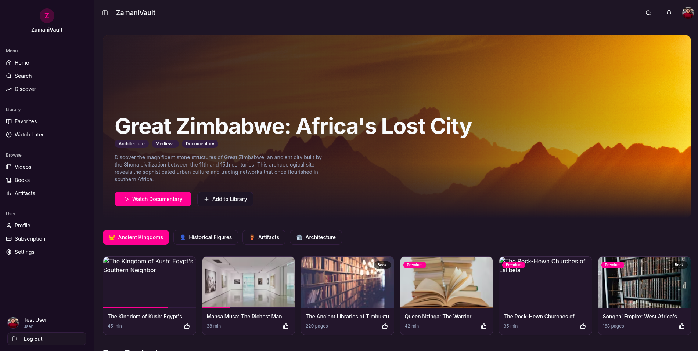

# 🌍 ZamaniVault: Exploring African Heritage & History

<div align="center">
  
  <p><i>Unveiling the Rich Tapestry of African Stories</i></p>
</div>

## 🌟 Project Overview

ZamaniVault is an innovative digital platform dedicated to preserving, exploring, and celebrating African history, culture, and heritage through immersive multimedia content.

## 📸 Project Screenshots

<div align="center">
  
</div>

## ✨ Key Features

### 🔍 Content Discovery
- Extensive library of videos, books, artifacts, and educational materials
- Advanced search and filtering capabilities
- AI-powered content recommendations

### 🔐 User Experience
- Secure authentication system
- Personalized user profiles
- Flexible subscription models
- Watchlist and favorites functionality

### 🤖 AI & Machine Learning
- Intelligent content recommendations
- User interest analysis
- Trend prediction for historical content
- Personalized learning paths

## 🛠 Technology Stack

### Frontend
- React with TypeScript
- TanStack Query
- Tailwind CSS
- shadcn/ui components
- Recharts for data visualization

### Backend
- Django REST Framework
- MongoDB
- JWT Authentication
- Machine Learning Models (scikit-learn, TensorFlow)

## 🚀 Getting Started

### Prerequisites
- Node.js (v18+)
- Python (v3.9+)
- MongoDB

### Frontend Setup
```bash
cd frontend
npm install
npm run dev
```

### Backend Setup
```bash
cd backend
python -m venv venv
source venv/bin/activate
pip install -r requirements.txt
python manage.py migrate
python manage.py runserver
```

## 🌐 Deployment

### Frontend
- Vercel
- Netlify
- AWS Amplify

### Backend
- Heroku
- AWS EC2
- DigitalOcean

## 📊 ML Model Capabilities

1. Content Recommendation Engine
2. User Behavior Analysis
3. Historical Trend Prediction
4. Personalized Learning Insights

## 🤝 Contributing

1. Fork the repository
2. Create a feature branch
3. Commit your changes
4. Push to the branch
5. Create a Pull Request

## 📄 License

[MIT License](LICENSE)

## 🙏 Acknowledgements

- shadcn/ui for UI components
- Lucide React for icons
- Recharts for data visualization

---

**Made with ❤️ to celebrate African heritage**
